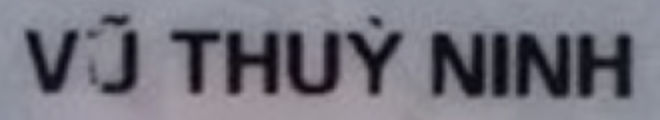
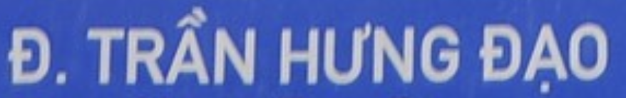

# VietOCR
 model exported/quantized to OpenVINO

## Installation

- Python >= 3.9
- Install the requirements: `pip install -r requirements.txt`

## Usage

- Run `python run.py` to run the demo on the images in the `images` folder.

```bash
usage: run.py [-h] 
              --encoder ENCODER_PATH 
              --decoder DECODER_PATH
              --input INPUT_PATH 
              [--beamsize BEAM_SIZE] 
              [--vocabs VOCABS_PATH]
```

| Argument  | Description | Default |
| ------------- | ------------- | ------------- | 
| `--encoder`  | Path to the encoder model  |  |
| `--decoder`  | Path to the decoder model  |  |
| `--input`  | Path to the input image  |  |
| `--beamsize`  | Beam size for beam search  | 4 |
| `--vocabs`  | Path to the vocabulary file  | `./config/vocab.yml` |


- The output images will be saved in the `output` folder.

## Results



`VŨ THUỲ NINH`



`Đ. TRẦN HƯNG ĐẠO`

## Maintainer

[Doku Tran](https://github.com/trancongman276)
